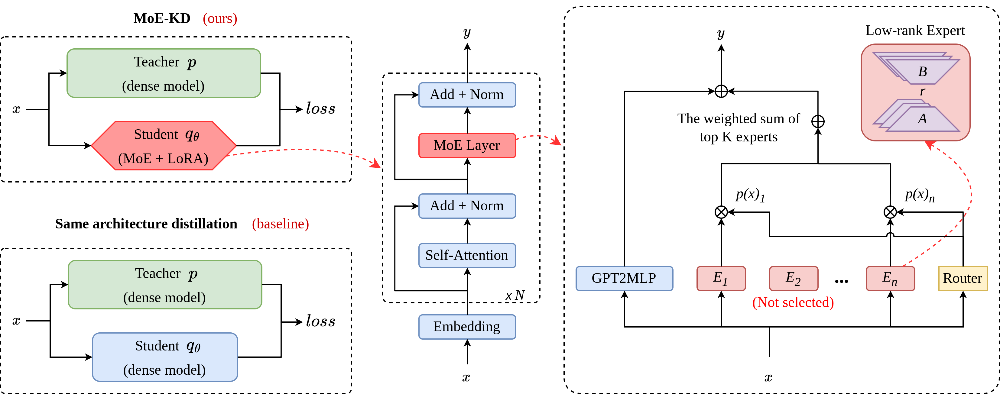

# Sparse Mixture of Experts Language Models Excel in Knowledge Distillation

This is the source code for [our research work ](paper%2FNLPCC2024_20240602.pdf).




## TLDR
We introduce the MoE and LoRA structure into knowledge distillation, and improve the effect of knowledge distillation of language models by reducing the gap between thestudent model and the teacher model.

## 0 Preparation
Install dependencies
```shell
pip install -r requirements.txt
```
Download GPT2 medium and small model from huggingface [gpt2](https://huggingface.co/openai-community/gpt2)

Modify the `ROOT_DIR=/the/path/to/MoE-KD` in all shell scripts under the [scripts](src%2Fscripts) directory.


## 1 SFT
### dense model sft on Dolly
```shell
# teacher model
sh src/scripts/sft/dolly/large-5e-5.sh
# student model
sh src/scripts/sft/dolly/small-5e-4.sh
```
### moe model sft
```shell
sh src/scripts/sft/dolly/moe-small-5e-4.sh
```

## 2 KD

```shell
sh src/scripts/kd/dolly/large2small-5e-5.sh
```
### result
```json
{
  "exact_match": 2.4,
  "rougeL": 23.5162,
  "eval_num": 500
}

```

## 3 MOE-KD
```shell
# moe-kd
sh src/scripts/kd/dolly/moe-large2small-5e-5.sh
```
### result
```json
{
  "exact_match": 2.8,
  "rougeL": 24.7329,
  "eval_num": 500
}
```

# Citation

If you use or reference our work in your research, please cite our paper as follows:

```bibtex
@inproceedings{Xu2024Sparse,
  title={Sparse Mixture of Experts Language Models Excel in Knowledge Distillation},
  author={Xu, Haiyang and Liu, Haoxiang and Gong, Wei and Deng, Xianjun and Wang, Hai},
  booktitle={Proceedings of the 13th CCF International Conference on Natural Language Processing and Chinese Computing},
  year={2024},
}

